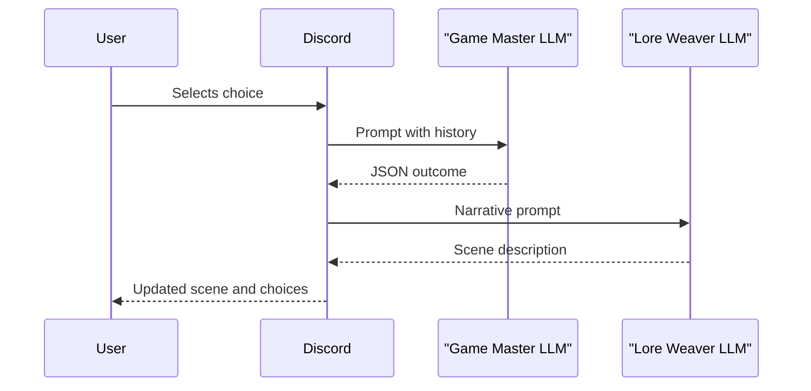

# System Architecture

This document provides a high‑level overview of the Discord bot powering **Iron Accord**. It explains the main services, how data flows between them and how to configure the project for local development.

## Overview
The bot acts as a text‑based game master. Player interactions in Discord are routed through asynchronous Python services that call two separate Large Language Models (LLMs) via [Ollama](https://github.com/jmorganca/ollama). One model handles fast rule resolution while the second focuses on rich narrative output.

## Core Components
- **Discord Cogs & Views** – Command and UI handlers that surface bot features to players.
- **Mission Engine & Services** – Coordinates mission state and determines the next scene based on player choices.
- **Ollama Service** – Thin wrapper around the local Ollama API used to query different LLMs.
- **RAG Service & ChromaDB** – Provides retrieval‑augmented generation for lore lookups and context building.

## Dual‑LLM Data Flow
The mission engine relies on two LLM calls to keep gameplay responsive. The sequence diagram below shows the "happy path" when a player presses a button during a mission.

Both LLM calls are awaited concurrently so the slower narrative response never blocks mechanics resolution.

## Setup & Configuration
Create a `.env` file based on `.env.example` and supply the following variables:

- `DISCORD_TOKEN` – your bot token
- `APP_ID` – Discord application ID
- `DISCORD_GUILD_ID` – guild used for command registration
- `DB_HOST`, `DB_USER`, `DB_PASSWORD`, `DB_DATABASE` – MySQL connection details
- `OLLAMA_API_URL` – base URL of the local Ollama server
- `OLLAMA_NARRATOR_MODEL` – model for narrative text (default `mixtral:8x7b-instruct-v0.1-q4_0`)
- `OLLAMA_GM_MODEL` – model for fast game‑master responses (default `phi3:mini`)

After installing dependencies (`pip install -r requirements.txt`) run `python -m ironaccord_bot.bot` to start the bot.
