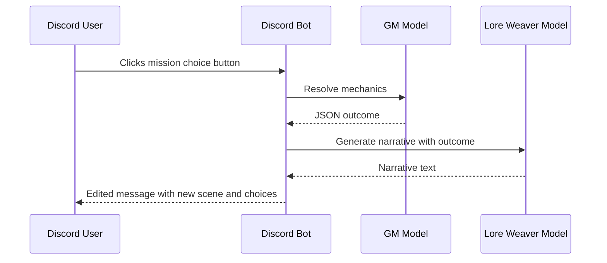

# Architecture Overview

This document describes the high level structure of the Iron Accord bot and how the dual‑LLM system processes a player's actions. It complements the design details found in [dual_llm_engine.md](dual_llm_engine.md).

## Core Components

- **Discord Cogs & Views** – command handlers and UI elements exposed to players.
- **Mission Engine & Services** – orchestrates missions, calling out to the LLMs and tracking per–user progress.
- **Ollama Service** – thin wrapper around the locally hosted LLMs used for narration (`narrator_model`) and fast rules resolution (`gm_model`).
- **RAG Service & ChromaDB** – optional retrieval component that feeds additional lore snippets into prompts.

## Dual‑LLM Data Flow

## Setup & Configuration

The bot is configured via environment variables. Copy `.env.example` to `.env` and provide the following values:

- `DISCORD_TOKEN`, `APP_ID`, `DISCORD_GUILD_ID` – Discord application settings.
- `DB_HOST`, `DB_USER`, `DB_PASSWORD`, `DB_DATABASE` – MySQL connection for persistent data.
- `OLLAMA_API_URL` – base URL of the local Ollama server.
- `OLLAMA_NARRATOR_MODEL`, `OLLAMA_GM_MODEL` – model names used for narration and rules logic.

Run `python -m ironaccord_bot.bot` to start the bot after installing dependencies and building the lore database with `python ironaccord_bot/ingest.py`.
